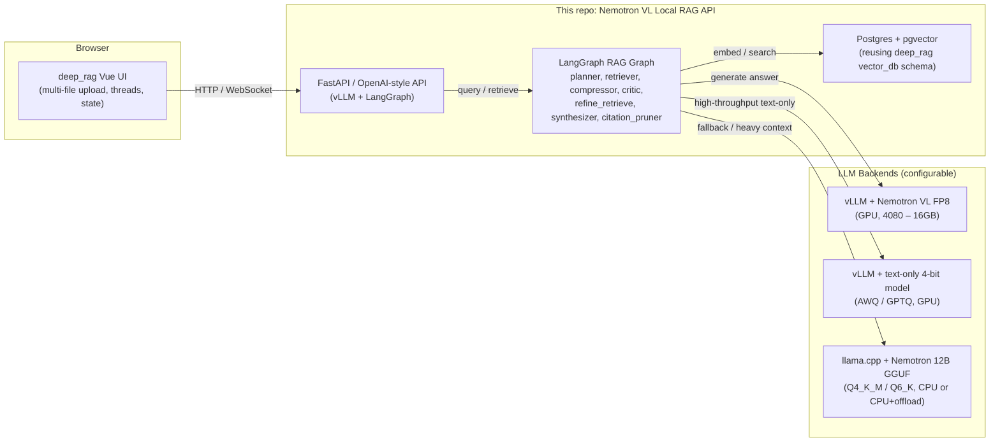
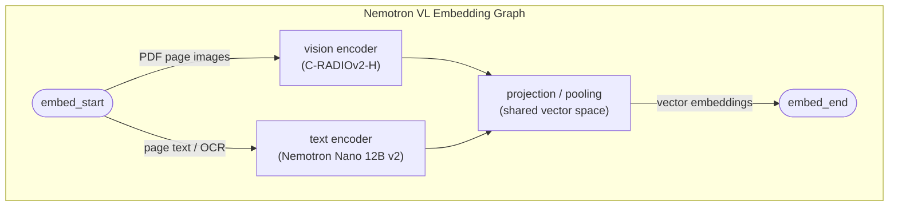

# (WIP) Nemotron VL Local RAG – LangGraph + deep_rag Frontend

This repository is a **local, multi-modal RAG playground** that extends the ideas in
[`scmclimited/deep_rag`](https://github.com/scmclimited/deep_rag) to support:

- **Local NVIDIA Nemotron VL 12B v2** (FP8/FP4/BF16) via **vLLM**  
- **CPU / GGUF**-based inference for edge / offline scenarios  
- A **LangGraph-based RAG pipeline** wired into the existing `deep_rag` **vector DB** layout  
- The original **Vue.js frontend** and **Postgres/pgvector** DB structure from `deep_rag`  

> In other words: this project lets you reuse the **UI and DB** from `deep_rag` but swap out the
> **Gemini 2.0 Flash API** for a **local Nemotron VL / text-only stack** with flexible quantization.

---

## 1. High-Level Architecture



The **vector DB** and **UI** are conceptually the same as in `deep_rag`:

- `vector_db/` – Postgres + pgvector schema + alembic-style migrations.
- `deep_rag_frontend_vue/` – Vue UI for multi-document PDF/image uploads and thread management.

This project **does not embed their code directly**; instead, it ships a helper script to **clone/copy**
the relevant directories into this repo.

---

## 2. Hardware Scenarios & Backends

We target a machine like:

- **GPU:** NVIDIA RTX 4080 (16 GB VRAM)  
- **CPU:** AMD Ryzen 9 5950X (16c/32t)  
- **RAM:** 128 GB system memory  

### 2.1 GPU-first matrix (Nemotron 12B / VL)

| Scenario | Model / Precision | Stack | Fit in 16 GB? | Notes |
|---------|-------------------|-------|---------------|-------|
| Vision-Language RAG (images + text) | `NVIDIA-Nemotron-Nano-12B-v2-VL-FP8` | vLLM (`--quantization modelopt`) | ✅ | Recommended for **multi-modal RAG**; FP8 is fast and small enough. |
| VL max quality | `NVIDIA-Nemotron-Nano-12B-v2-VL-BF16` | vLLM (`--dtype bfloat16`) | ⚠️ | Highest quality but tight VRAM; may spill to CPU / use paged KV cache. |
| Text-only high-throughput | `NVIDIA-Nemotron-Nano-12B-v2` text-only 4‑bit | vLLM + AWQ/GPTQ | ✅ | Great for high QPS chat / RAG without vision. |
| Text-only research | 7B–8B FP16/BF16 models | vLLM / Transformers | ✅ | For debugging / maximal quality in smaller models. |

### 2.2 CPU-first / hybrid matrix (GGUF + 5950X + 128 GB RAM)

| Scenario | Model / Quant | Stack | RAM / VRAM | Notes |
|---------|---------------|-------|-----------|-------|
| Offline assistant (text-only) | Nemotron 12B Q4_K_M GGUF | llama.cpp (CPU-only) | ~7.5 GB + KV cache | Robust, no GPU dependency. |
| Hybrid CPU + GPU offload | Nemotron 12B Q4_K_M / Q6_K GGUF | llama.cpp with partial GPU offload | 7.5–10 GB RAM + 2–6 GB VRAM | Faster tokens/s; still usable if GPU is busy. |
| Multi-model routing | 7B + 12B GGUF | llama.cpp (multiple instances) | 5–10 GB per model | Have a small router model + a “deep thinker” 12B model. |

The backend code uses **environment variables** to decide:

- Which **LLM backend** is primary (Nemotron VL FP8 vs text-only vs GGUF).
- How much **GPU offload** to perform in GGUF mode (if enabled).
- Whether **RAG** calls use VL (for images) or text-only embeddings.

---
### 2.3 Model Storage: `MODEL_DIR`

All model downloads, ONNX exports, and GGUF conversions are routed
through a single environment variable:

```bash
MODEL_DIR="D:/Models"
```

- On Windows Git Bash / MSYS2, prefer forward slashes (`D:/Models`).
- On Linux/macOS, use a normal unix path (`/mnt/models`, `/data/models`, etc.).

By default, if `MODEL_DIR` is not set, the code assumes:

```text
D:/Models
```

### Directory layout (recommended)

When you run the provided scripts and Make targets, you’ll end up with a layout like:

```text
D:/Models/
├── nemotron_vl_fp8/            # Nemotron VL FP8 checkpoint (vLLM-friendly)
├── nemotron_text_12b/          # Text-only Nemotron 12B
├── onnx/
│   └── nemotron_12b_bf16.onnx  # ONNX export
│   └── nemotron_12b_int8.onnx  # INT8 quantized ONNX
└── gguf/
    └── nemotron_12b_q4_k_m.gguf  # GGUF Q4_K_M for llama.cpp
```

You can change subdirectory names by adjusting script arguments if desired.


---

## 3. Formats, Sizes & Trade-offs

We heavily lean on three families of formats:

### 3.1 Nemotron VL official checkpoints

From NVIDIA’s Hugging Face collection:

| Variant | Type | Format | Approx Size |
|--------|------|--------|-------------|
| `NVIDIA-Nemotron-Nano-12B-v2-VL-BF16` | VL | BF16 safetensors | ~26.4 GB |
| `NVIDIA-Nemotron-Nano-12B-v2-VL-FP8` | VL | FP8 safetensors | **15.4 GB** |
| `NVIDIA-Nemotron-Nano-12B-v2-VL-NVFP4-QAD` | VL | FP4 TensorRT modelopt | ~8–10 GB (inferred) |

FP8 and FP4 are handled via **NVIDIA modelopt** inside **vLLM**.

### 3.2 GGUF quantizations for text-only Nemotron 12B

There are community GGUF builds (e.g., via `bartowski/nvidia_NVIDIA-Nemotron-Nano-12B-v2-GGUF`).
Sizes are roughly:

| Quantization | Approx Size | Comment |
|--------------|-------------|---------|
| BF16 | ~24.6 GB | Almost full precision; overkill for CPU-only. |
| Q8_0 | ~13.1 GB | Very high quality. |
| Q6_K / Q6_K_L | ~10.1–10.4 GB | “Near-BF16” quality; solid choice. |
| Q5_K_L | ~9.2 GB | Strong. |
| Q4_K_L / Q4_K_M | ~8.0 / 7.5 GB | Sweet spot for 12B on CPU. |
| Q3 / Q2 | ~5–7 GB | Only if you are extremely RAM constrained. |

### 3.3 Precision vs. format – rule-of-thumb

| Precision / Format | Bytes / Param | Typical Use |
|--------------------|--------------|-------------|
| BF16 / FP16 | 2 | Training / high-end GPU inference |
| FP8 | 1 | High-throughput GPU inference (vLLM + modelopt) |
| FP4 / NVFP4 | 0.5 | Max compression on GPU (TensorRT-LLM) |
| GGUF Q6_K | ~0.8–1.0 | High-quality CPU or hybrid |
| GGUF Q4_K_M | ~0.6 | Balanced CPU performance / memory |

---

## 4. RAG Architecture vs `deep_rag`

The original [`scmclimited/deep_rag`](https://github.com/scmclimited/deep_rag):

- Uses **Gemini 2.0 Flash** as the **LLM & multi-modal endpoint**.
- Implements a **hybrid retriever** (lexical + vector) with:
  - `K_RETRIEVER`, `K_VEC`, `K_LEX`,
  - A **cross-encoder reranker**,
  - A **confidence-based synthesizer** that can abstain (“I don’t know”),
  - The following LangGraph-inspired nodes:

```text
__start__ → planner → retriever → compressor → critic
critic → refine_retrieve → compressor
critic → synthesizer → citation_pruner → __end__
```

This project:

- **Reuses**:
  - The database structure (`vector_db/`),
  - The frontend UI (`deep_rag_frontend_vue/`),
  - The general **planner/retriever/compressor/critic/synthesizer** idea.
- **Replaces**:
  - **Gemini** with a **local Nemotron VL / text-only backend**.
  - The original embedding flow with a **Nemotron-based multi-modal embedding pipeline**.

### 4.1 New multi-modal embedding pipeline

In this project, we introduce a **Nemotron VL embedding LangGraph subgraph**:



- **PDF & images**: handled by a pipeline that extracts:
  - Text (OCR + layout),
  - Page-level or region-level images.
- Both go through the Nemotron VL stack to create **aligned embeddings** that are indexed in
  the **same pgvector table** you use in `deep_rag`.

> The goal: you can query **text about visual content** later (e.g., “show me invoices where the logo looks like X”)
> using the same RAG infrastructure.

---

## 5. Graph Node Quantization Recommendations

Because different nodes have different sensitivity to precision, we recommend:

| Graph Node | Role | Recommended Backend | Quantization Guidance |
|------------|------|---------------------|------------------------|
| `planner` | Interprets user query, plans steps | Text-only Nemotron 12B via vLLM | FP8 (GPU) or Q6_K (GGUF). |
| `retriever` | Calls vector DB + lexical search | CPU / DB bound | Not LLM-heavy; use normal Postgres/pgvector. |
| `compressor` | Merges & compresses chunks | Nemotron text-only (short prompts) | FP8 or Q4_K_M. |
| `critic` | Decides if answer is sufficient | Nemotron text-only | FP8 or Q6_K – important for control flow. |
| `refine_retrieve` | Optional next retrieval step | Same as `retriever` | Little LLM load; reuse `critic` backend if needed. |
| `synthesizer` | Generates final answer | Nemotron VL or text-only (long prompts) | FP8 on GPU for best balance; if CPU-only, Q4_K_M. |
| `citation_pruner` | Filters hallucinated citations | Lightweight LLM calls | FP8 or gguf Q5/Q4 is fine. |
| `embed_*` | Image/text embedding for the vector DB | Nemotron VL encoders | Prefer FP16/FP8 – avoid very aggressive quantization to preserve retrieval quality. |

---

## 6. Project Layout

```text
nemotron_rag_app/
├── backend/
│ └── app/
│ ├── api/
│ │ ├── chat.py # /v1/chat/completions (OpenAI-style)
│ │ └── rag.py # /rag/query (full RAG endpoint)
│ ├── inference/
│ │ ├── router.py # Chooses between vLLM, GGUF, or ONNX backends
│ │ ├── vllm_client.py # vLLM client for Nemotron VL FP8 / text models
│ │ └── llama_cpp_client.py # Optional llama.cpp/GGUF client
│ ├── rag/
│ │ ├── embeddings.py # Multi-modal embedding node (Nemotron-VL)
│ │ ├── graph.py # LangGraph RAG graph assembler
│ │ ├── nodes.py # Planner, retriever, compressor, critic, etc.
│ │ └── vectorstore.py # Wrapper over deep_rag’s pgvector schema
│ ├── scripts/
│ │ ├── download_model.py # MODEL_DIR-aware Nemotron download
│ │ ├── export_onnx.py # Export text model → ONNX
│ │ ├── quantize_onnx.py # Quantize ONNX → INT8
│ │ └── export_gguf.py # Convert HF → GGUF (through llama.cpp)
│ ├── config.py # Settings (MODEL_DIR, DB URL, inference mode)
│ └── main.py # FastAPI entrypoint
│
├── deep_rag_frontend_vue/ # Vue UI copied from scmclimited/deep_rag
│ # (multi-file upload, threads, chat UI)
├── vector_db/ # deep_rag Postgres + pgvector schema
│ # (same structure as original deep_rag repo)
│
├── scripts/
│ └── setup_deep_rag_assets.sh # Syncs deep_rag UI + DB assets into project
│
├── md_guides/ # Documentation (formulas, retrieval math, etc.)
│
├── .env.example # MODEL_DIR=D:/Models + DB + RAG settings
├── Makefile # MODEL_DIR-aware download/quantization tasks
├── docker-compose.yml # vLLM server + backend + frontend + pgvector
├── Dockerfile.backend # Builds backend service
├── Dockerfile.frontend # Builds Vue UI (deep_rag)
├── Dockerfile.vllm # Runs Nemotron VL inside vLLM
│
├── pyproject.toml # Python deps, backends, LangGraph, Typer scripts
├── LICENSE
└── README.md # Top-level documentation
```

---

## 7. Setup: Cloning deep_rag Assets

This project expects you to **reuse**:

- The **vector DB** definitions and migrations.
- The **Vue.js frontend**.

Run:

```bash
make init-deep-rag
```

which internally runs:

```bash
./scripts/setup_deep_rag_assets.sh
```

That script will:

1. Clone `scmclimited/deep_rag` into a temporary directory.
2. Copy:
   - `deep_rag_frontend_vue/` → `./deep_rag_frontend_vue/`
   - `vector_db/` → `./vector_db/`
3. Copy `.env.example`, `md_guides/` if helpful.

> If you already have `deep_rag` cloned locally, you can edit the script or copy these directories manually.

---

## 8. Environment & Dependencies

### 8.1 Prerequisites

- Python **3.13+**
- Docker + Docker Compose
- NVIDIA GPU drivers + `nvidia-container-toolkit` (for vLLM GPU containers)
- `make`
- (optional) a checkout of `llama.cpp` if you plan on **GGUF conversion**.

### 8.2 Env & MODEL_DIR Quickstart

1. Copy the env template:

```bash
cp .env.example .env
```

2. Edit `.env`:

```dotenv
MODEL_DIR=D:/Models
# other DB + RAG settings...
```

3. In shells where you call the model tools directly, you can also export:

```bash
export MODEL_DIR="D:/Models"
```

The backend’s `Settings` class will normalize `MODEL_DIR` and derive default paths
for ONNX and GGUF artifacts from it, unless you explicitly override them in `.env`.


### 8.3 Python env (backend only)

```bash
python -m venv .venv
source .venv/bin/activate
pip install -U pip
pip install -e ./backend/
pip install -r requirements.txt

```

Conda alternative

```bash
conda -n nemotron python=3.13
conda activate nemotron

```

This uses the `pyproject.toml` configuration at the repo root.

---

## 9. Model Download & Quantization Flows

All of these flows are implemented as Python CLIs hooked via `pyproject.toml` and exposed in `Makefile`.

### 9.1 Download Nemotron VL FP8 for vLLM

```bash
MODEL_DIR="D:/Models" make download-model-vl-fp8
```

This runs:

```bash
nemotron-download --variant vl-fp8
```

Which is a thin wrapper around:

- Hugging Face `snapshot_download(...)`,
- Checking for GPU compatibility,
- Writing paths into `.env` (e.g., `NEMOTRON_VL_MODEL_ID=nvidia/NVIDIA-Nemotron-Nano-12B-v2-VL-FP8`).

### 9.2 Export text-only Nemotron 12B to ONNX + INT8

```bash
MODEL_DIR="D:/Models" make export-onnx-int8
```

Which maps to:

```bash
nemotron-export-onnx --precision bf16   --out backend_models/nemotron_12b_bf16.onnx

nemotron-quantize-onnx --in backend_models/nemotron_12b_bf16.onnx   --out backend_models/nemotron_12b_int8.onnx
```

These CLIs:

- Use `transformers` to export a **causal LM** ONNX graph.
- Use `onnxruntime.quantization.quantize_dynamic` for INT8.
- Can be wired into ONNX Runtime or TensorRT-LLM in a more advanced deployment.

### 9.3 Convert text-only Nemotron 12B to GGUF

```bash
MODEL_DIR="D:/Models" make export-gguf-q4
```

Which expects that you have:

- `llama.cpp` cloned in `./tools/llama.cpp`,

```bash
git clone https://github.com/ggerganov/llama.cpp.git tools/llama.cpp`

pip install -r tools/llama.cpp/requirements.txt

```
- Its Python dependencies installed.

It then runs something like:

```bash
nemotron-export-gguf   --hf-id nvidia/NVIDIA-Nemotron-Nano-12B-v2   --llama-cpp ./tools/llama.cpp   --out ./backend_models/nemotron_12b_q4_k_m.gguf   --quant q4_k_m
```

> This gives you a **GGUF Q4_K_M** file suitable for CPU-heavy or hybrid inference via `llama.cpp`.

---

## 10. Running the Stack (Docker)

### 10.1 Environment

Copy the example env:

```bash
cp .env.example .env
```

Then edit:

- `POSTGRES_*` variables if needed.
- `NEMOTRON_VL_MODEL_ID`, `NEMOTRON_TEXT_MODEL_ID`.
- `INFERENCE_MODE` (e.g. `vl_fp8`, `text_4bit`, `cpu_gguf`).
- `GGUF_MODEL_PATH` (if using GGUF backend).
- `GPU_OFFLOAD_FRACTION` (0.0–1.0, used by backend to tune offloading).

### 10.2 Start vLLM + DB + backend (+ optional frontend)

```bash
make up
```

This is equivalent to:

```bash
INFERENCE_MODE=vl_fp8 GPU_OFFLOAD_FRACTION=0.4 docker compose up --build
```

### 10.3 Tear down

```bash
make down
```

---

## 11. OpenAI-style API Usage

The backend exposes an **OpenAI-compatible** endpoint:

- `POST /v1/chat/completions`

Example:

```bash
curl http://localhost:8000/v1/chat/completions   -H "Content-Type: application/json"   -d '{
    "model": "nemotron-vl",
    "messages": [
      {"role": "user", "content": [
        {"type": "text", "text": "Summarize this purchase order."},
        {"type": "image_url", "image_url": { "url": "file:///data/po_001.png" }}
      ]}
    ],
    "max_tokens": 256
  }'
```

For **text-only**:

```bash
curl http://localhost:8000/v1/chat/completions   -H "Content-Type: application/json"   -d '{
    "model": "nemotron-text",
    "messages": [
      {"role": "user", "content": "Explain how GGUF Q4_K_M compares to FP8 Nemotron for edge inference."}
    ],
    "max_tokens": 256
  }'
```

---

## 12. RAG Endpoint

The RAG endpoint:

- `POST /rag/query`

Example payload:

```json
{
  "thread_id": "123e4567-e89b-12d3-a456-426614174000",
  "query": "What are the late-payment terms across all my uploaded invoices?",
  "cross_doc": true,
  "selected_doc_ids": [],
  "uploaded_doc_ids": []
}
```

Internally, this will:

1. Run the **planner** node on the configured LLM backend.
2. Query the **vector DB** using:
   - `K_RETRIEVER`, `K_VEC`, `K_LEX` thresholds from `.env`.
3. Compress and rank retrieved chunks.
4. Use `critic` to decide whether to:
   - Answer immediately (single-pass),
   - Or `refine_retrieve` with tighter filters.
5. Call the **synthesizer** using Nemotron VL / text-only backend.
6. Prune citations and return a structured response:

```json
{
  "answer": "Most invoices specify net 30 days, with a 5% late fee after 45 days.",
  "citations": [
    {"doc_id": "inv_2024_001", "page": 2, "score": 0.89},
    {"doc_id": "inv_2024_014", "page": 1, "score": 0.83}
  ],
  "metadata": {
    "backend": "nemotron-vl-fp8",
    "tokens": { "prompt": 1024, "completion": 128 }
  }
}
```

---

## 13. Make Targets Overview

Key targets in `Makefile`:

| Target | Description |
|--------|-------------|
| `make init-deep-rag` | Clone/copy `deep_rag` frontend + vector DB into this project. |
| `make download-model-vl-fp8` | Download Nemotron VL FP8 from Hugging Face. |
| `make export-onnx-int8` | Export text-only Nemotron 12B → ONNX → INT8. |
| `make export-gguf-q4` | Export text-only Nemotron 12B → GGUF Q4_K_M. |
| `make up` | Build & run Docker stack (DB, vLLM, backend, optional frontend). |
| `make down` | Stop and remove containers. |

You can override some vars:

```bash
INFERENCE_MODE=cpu_gguf GPU_OFFLOAD_FRACTION=0.7 make up
```

---

## 14. Notes & Limitations

- The project is designed as a **bridge** between:
  - `deep_rag`’s **Gemini-based** cloud RAG,
  - and a **local Nemotron VL / text-only** RAG stack.
- You are expected to:
  - Provide your own **Hugging Face token** (if required),
  - Accept NVIDIA’s **Open Model License** for Nemotron.
- GGUF conversions depend on **llama.cpp** and are not bundled here – this repo only wires the flow.

---

## 15. Next Steps

- Use this project to **prototype**:
  - Multi-modal RAG over local PDFs/images,
  - Different quantization strategies per graph node,
  - Resilience patterns (GPU primary, CPU GGUF fallback).
- Extend the LangGraph graph in `backend/app/rag/graph.py` to:
  - Add tracing/telemetry,
  - Add extra tools (e.g., SQL retrieval against non-vector tables),
  - Explore separate smaller router models.

Pull requests and local modifications are encouraged – this is meant to be a **playground** for
edge-friendly, multi-modal RAG architectures built on Nemotron + LangGraph + deep_rag’s UX.
